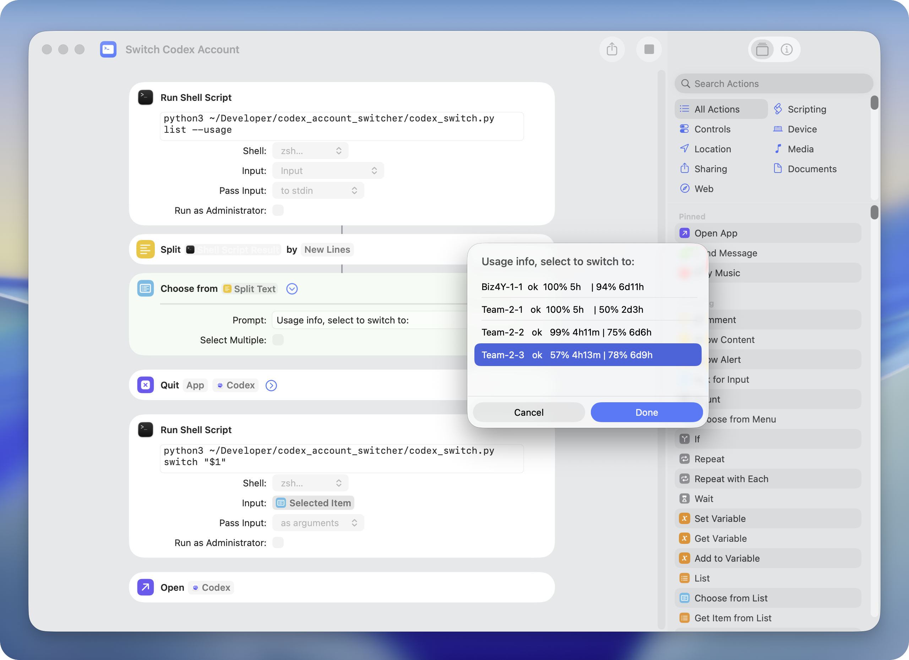
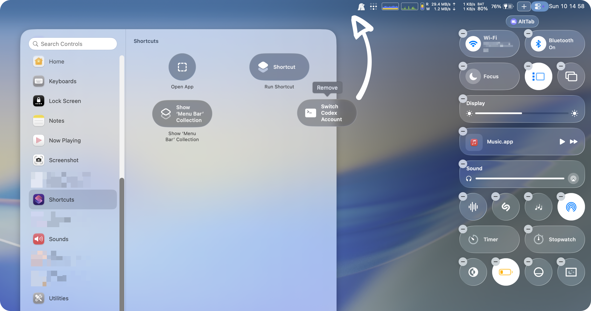
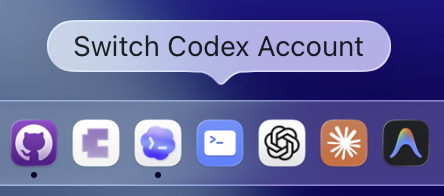

# Codex Shortcut Switcher

Have multiple Codex accounts, such as work and personal, and need a quick way to switch between them? Want to see each account's remaining usage and reset time before choosing? Don't want to install another app with complex dependencies or unclear background behavior?

Codex Shortcut Switcher is a small, dependency-free Python script for switching Codex accounts from the CLI or a native macOS Shortcut. The picker can show each account's remaining 5-hour and weekly usage windows, and the main workflow is designed for Apple Shortcuts so it can be integrated into your system.

Under the hood, switching is deliberately boring: it stores named local copies of Codex `auth.json` files and uses basic filesystem calls to copy the selected one into `~/.codex/auth.json`. Use the CLI to add logged-in Codex accounts, then use Shortcuts to make switching feel native.

## Get Started



First, add the currently logged-in Codex account:

```bash
cd /path/to/codex-shortcut-switcher
python3 codex_switch.py add <alias> --from-current
```

Then create a new Apple Shortcut with this flow:

1. Run `codex_switch.py list --usage`
2. Split the output by new lines
3. Choose an account from the list. If the user selects cancel, the Shortcut terminates early without making changes, which is useful if you only wanted to browse current usage across accounts
4. If an account is selected, quit Codex
5. Run `codex_switch.py switch "$1"` with the selected item passed as an argument
6. Open Codex again

### Shortcut Shell Commands

Use the real path where you cloned the repo. The first shell action can run:

```bash
python3 /path/to/codex-shortcut-switcher/codex_switch.py list --usage
```

Then, in the second shell action, set **Pass Input** to **as arguments** and run:

```bash
python3 /path/to/codex-shortcut-switcher/codex_switch.py switch "$1"
```

## Launch Options

Because the switcher is just a normal macOS Shortcut, you can trigger it with any native or third-party shortcut launcher.

Common options:

- Search and run it from Spotlight or another launcher like Raycast and Alfred that can invoke Shortcuts
- Add it to the menu bar
- Add it as a Control Center widget
- Pin it to the Dock





## CLI Capabilities

The same script can be used directly from Terminal:

```bash
# Change directory to your local clone of this repo
cd /path/to/codex-shortcut-switcher

# Store the current Codex login as an account alias (nickname).
python3 codex_switch.py add <alias> --from-current

# Store a specific auth.json as an account alias.
python3 codex_switch.py add <alias> --from-auth /path/to/auth.json

# Replace an existing alias with the current login.
python3 codex_switch.py add <alias> --from-current --replace

# List compact account rows for Shortcuts.
python3 codex_switch.py list

# List rows with 5-hour and weekly usage remaining plus reset countdowns.
python3 codex_switch.py list --usage

# Include stored profile paths for terminal inspection.
python3 codex_switch.py list --path

# Print aliases only, one per line.
python3 codex_switch.py aliases

# Switch the default Codex login.
python3 codex_switch.py switch <alias>

# Remove one alias from the switcher.
python3 codex_switch.py remove <alias>

# Remove one alias and delete its stored auth copy.
python3 codex_switch.py remove <alias> --delete-home

# Remove every alias from the switcher.
python3 codex_switch.py remove-all --yes

# Remove every alias and delete all stored auth copies.
python3 codex_switch.py remove-all --yes --delete-homes

# Run a command with CODEX_HOME pointed at one account profile.
python3 codex_switch.py run <alias> -- codex

# Print a shell export for manual use.
python3 codex_switch.py env <alias>
```

If you want a `codex-switch` command without typing the script path, symlink the script into a directory on your `PATH`:

```bash
cd /path/to/codex-shortcut-switcher
mkdir -p ~/.local/bin
ln -sf "$PWD/codex_switch.py" ~/.local/bin/codex-switch
codex-switch list --usage
```

If `~/.local/bin` is not on your `PATH`, add it to your shell profile first:

```bash
export PATH="$HOME/.local/bin:$PATH"
```

## Storage

By default, state lives in `~/.codex-shortcut-switcher`.

Stored files:

- `aliases.json`: alias metadata and local `CODEX_HOME` paths only.
- `homes/<alias>/auth.json`: copied Codex auth file for that account.

You can override the state directory with `CODEX_SWITCH_HOME` or `--store`.
By default, `remove` and `remove-all` only remove aliases from switcher metadata. Use `--delete-home` or `--delete-homes` when you also want to delete stored auth copies under the switcher state directory.

## Safety Notes

- The tool never prints `auth.json` contents.
- State directories and copied auth files are written with owner-only permissions on Unix.
- `switch` backs up the previous active auth file as `~/.codex/auth.json.codex-switch-backup`.
- `list --usage` calls the ChatGPT usage endpoint with the current access token, but it does not use refresh tokens. This avoids rotating a refresh token behind Codex and invalidating another `auth.json` copy.
- Usage percentages and reset countdowns are best-effort displays of the API response and may change if Codex/OpenAI changes the usage endpoint.
- API-key accounts can be stored and switched, but `list --usage` cannot show ChatGPT/Codex usage for API-key auth.
- Only use this with accounts you own or are explicitly authorized to use, and follow OpenAI's terms, policies, and usage rules.

## Development

Run tests with:

```bash
PYTHONPATH=. python3 -m unittest discover -s tests
```
